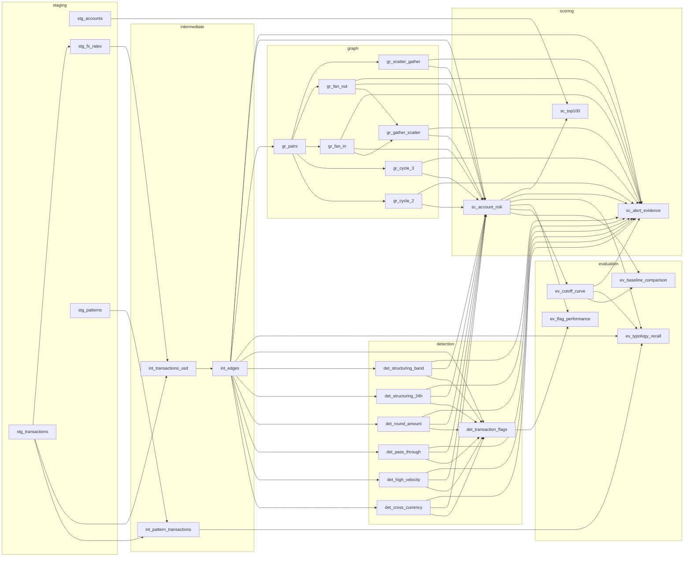

# Model lineage

Generated from `target/manifest.json`, so it matches the built DAG rather than a hand
drawing. 28 models across 6 layers, 66 dependencies.

Regenerate with `dbt parse` followed by `python3 scripts/render_lineage.py`.

